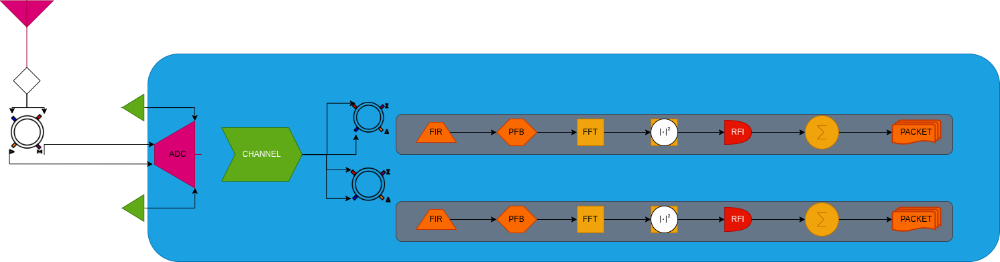
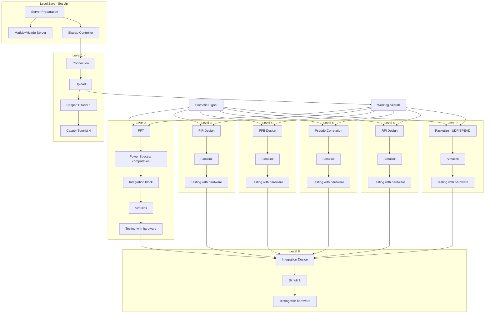
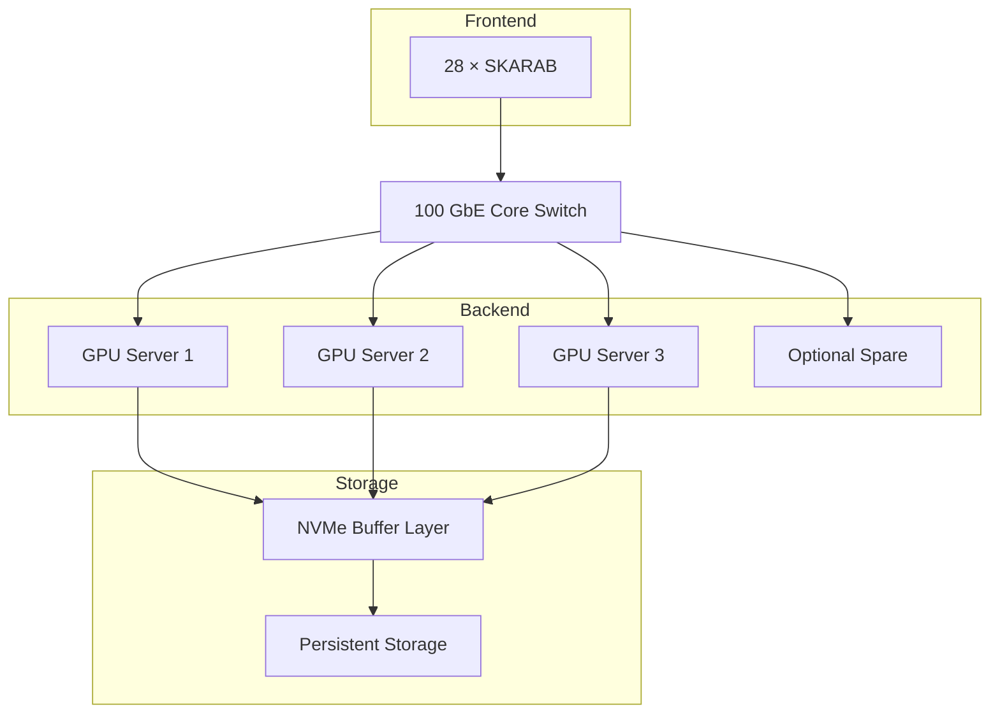

# Skarab Roadmap

## Pipeline Server

## 1. Science & Signal Processing Parameters

| Item                 | Value                  | Notes                         |
| -------------------- | ---------------------- | ----------------------------- |
| Telescope frontend   | Pseudo-correlator      | Sky − Reference differencing  |
| Number of horns      | 28                     | One SKARAB per horn           |
| Inputs per horn      | 4                      | Radiometer outputs            |
| Total digital inputs | 112                    | 28 × 4                        |
| ADC sampling rate    | 3 GSps                 | ADC32RF45-class               |
| ADC resolution       | 14–16 bits             | 16 bits preferred             |
| RF bandwidth         | 375 MHz                | After analog filtering        |
| Spectral channels    | 1024 - **4096**        | PFB + FFT                     |
| Integration time     | 1–10 ms                | 10 ms baseline survey         |
| FPGA RFI filtering   | Yes                    | Spectral thresholding/masking |
| Packet protocol      | UDP + sequence numbers | Jumbo frames                  |
| Data Rate            | 262 Mb/s               | 1 ms/per Horn                 |
| Output data type     | Power spectra          | 16-bit recommended            |

---

# 4. Backend Cluster Architecture

| Component          | Recommendation       | Specifications |
| ------------------ | -------------------- | --------------- |
| Backend servers    | 3 + 1 spare optional | AMD EPYC 9354P 32 cores 512 GB DDR5  |
| NIC     | 100 Gbs               |ConnectX-6 Dx 100GbE|
| GPU class          | 2 x RTX 4090      |
| Local storage      | NVMe RAID10 | 4× 3.84 TB U.2 E         |
| Persistent storage | Ceph                 | 100 - 200 Tb |
| Network fabric     | 100Gbps |  Mellanox SN2700 32 x 100 GbE|\x

