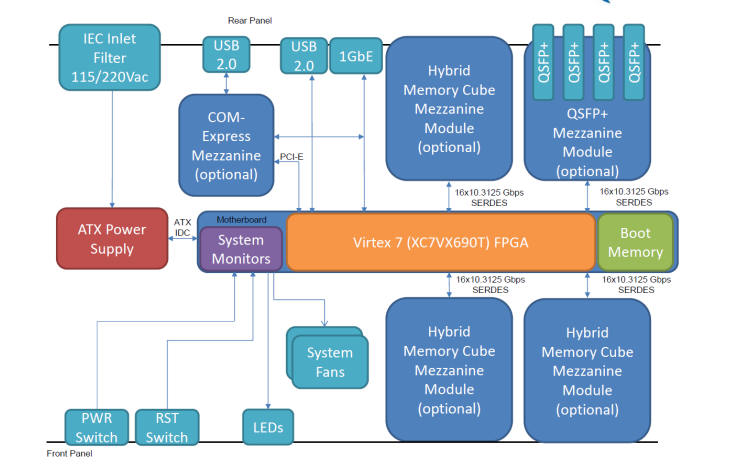

# BINGO Skarab PB

:::{admonition} **Project**
:class: alert
[GitHub Project Link](https://github.com/orgs/BINGO-PB/projects/5)
:::

## Problem Description

The SKARAB (Square Kilometer Array Reconfigurable Application Board) is a superscale FPGA-based computing platform, designed by Peralex Electronics in South Africa, in collaboration with SARAO for radio astronomy. It is the successor to ROACH2, focused on high performance, low latency, and digital signal processing.

This device will be used as the BINGO backend. It is necessary to:
- Determine the signal processing required to achieve BINGO's science objective, namely cosmological observations of neutral hydrogen and transient phenomena.
- Determine data transport from SKARAB to a controller computer.
- Build a pipeline on the controller to ingest SKARAB data, control its behavior, and transmit data downstream.

## History

:::{admonition} **Team**
:class: alert dropdown

- UFCG
    - Luciano Barosi
    - Jordany Vieira
    - Tales
    - Gutemberg
    - Valmir
    - João Vitor
- CHINA
    - Hector
- INPE
    - Cesar Strauss
    - Jorge
::: 

:::{admonition} **Hardware**
:class: alert dropdown
SKARAB BOARD
- FPGA Virtex-7 XC7VX690T
  - 690,000 logic cells
  - 3,600 DSP blocks
  - 53 Mb RAM
- ADC TI ADC32RF45
  - 14 bits
  - 3 GSps
- QSFP+ 40 GbE
:::

:::{admonition} **Science Requirements**
:class: important dropdown

#### Instrument

- FWHM
$$\theta = 40 \;\mathrm{arcmin}$$
- Bandwith
$$ 980 \;\mathrm{Mhz} \ge \nu \ge 1260 \;\mathrm{Mhz}$$
- Central Frequency: 
$$1100 \;\mathrm{Mhz}$$
* λ ≈ 0.27 m
- Effective Area
$$
\eta = 0.7 \\
\Omega = \frac{4}{\pi \log 2} \theta^2 \\
A_{\text{eff}} = \eta \frac{c}{\bar\nu}^2 \frac{1}{\Omega} \approx 321 \, \text{m}^2
$$
- System Temperature
$$
T_{Sys} = 40 \,\text{K}
$$
- Integration Time
$$
\tau = 1s
$$
---

#### Sky Temperature

Considering synchroton radiation:

$$
T \propto \nu^{-2.6}
$$

| Region                  | (T_A)        |
| ----------------------- | ------------ |
| high galactic latitude | **~3 K**     |
| low galactic latitude        | **~15–25 K** |

---

#### SEFD 

$$
SEFD = \frac{2k T_{\text{sys}}}{A_{\text{eff}}} \approx 350 \mathrm{K}
$$

#### Sensitivity

$$
\Delta S = \frac{SEFD}{\sqrt{B \tau}}
$$

#### Channel Sensitivity

$$
\Delta S = \frac{SEFD}{\sqrt{\Delta\nu \tau}}
$$

#### Data Rate

$$
\text{DataRate} = \frac{2 \times N_{\mathrm{pol}} \times  n_{\mathrm{bits}} \times n_{\mathrm{channels}}}{8 \times t_{\mathrm{int}} }
$$

#### Galactic Foreground 

$$
S = \frac{2kT_A}{A_{\text{eff}}}
$$

| Region                  | $ S$        |
| ----------------------- | ------------ |
| high galactic latitude | $\approx 10\;Jy$     |
| low galactic latitude        | $\approx 65\;Jy$ |
---

| n_channels | t_int=1s Sensitivity | t_int=1s Channel Sensitivity | t_int=1s · n_bits=12 Data Rate Horn | t_int=1s · n_bits=14 Total Data Rate | t_int=1ms Sensitivity | t_int=1ms Channel Sensitivity | t_int=1ms · n_bits=12 Data Rate Horn | t_int=1ms · n_bits=14 Data Rate Horn | n_taps=4 DSP Slices | n_taps=8 DSP Slices |
| :--- | ---: | ---: | ---: | ---: | ---: | ---: | ---: | ---: | ---: | ---: |
| 512 | 0.465 Jy | 0.465 Jy | 0.000003 Gbyte / s | 0.0001 Gbyte / s | 14.71 Jy | 14.71 Jy | 0.003072 Gbyte / s | 0.003584 Gbyte / s | 6,032 | 6,074 |
| 1024 | 0.658 Jy | 0.658 Jy | 0.000006 Gbyte / s | 0.000201 Gbyte / s | 20.80 Jy | 20.80 Jy | 0.006144 Gbyte / s | 0.007168 Gbyte / s | 13,354 | 13,395 |
| 2048 | 0.930 Jy | 0.930 Jy | 0.000012 Gbyte / s | 0.000401 Gbyte / s | 29.41 Jy | 29.41 Jy | 0.012 Gbyte / s | 0.014 Gbyte / s | 29,328 | 29,370 |
| 4096 | 1.32 Jy | 1.32 Jy | 0.000025 Gbyte / s | 0.000803 Gbyte / s | 41.59 Jy | 41.59 Jy | 0.025 Gbyte / s | 0.029 Gbyte / s | 63,939 | 63,981 |

### Available code

- GITHUB repository: https://github.com/BINGO-PB/BINGO_SKARAB_AI
  - This repository contains firmware and control scripts for the SKARAB platform used in the BINGO (Baryon Oscillation Spectroscopic Survey) radio telescope project. The firmware is designed to work with the SKARAB (Square Kilometre Array Reconfigurable Application Board) platform equipped with Virtex-7 FPGA and ADC mezzanine cards.
- GITHUB repository: https://github.com/BINGO-PB/bingo_skarab
  - This repository allows creating containers for developing a SKARAB control system with different library versions.
- GITHUB repository: https://github.com/BINGO-PB/skarab-dev, has bingo-skarab as submodule and concentrates all the efforts for development and documentation.

## Challenges Encountered

## Action Plan

## Work Organization Decisions

:::{admonition} **Computers**
- : 🎉 **bingo01**: machine where *Matlab* and *Vivado* will be installed for bitstream development.
- 🎉 **bingo02**: Ubuntu 20.04 + Python 2.7, connected to SKARAB for control system development.
:::

:::{admonition} **Workflow**

⚠️ To be updated

- Stage 0/1 meetings - Tuesday 09:00 - ZOOM
- bi-weekly online alignment meetings
- 1-1 interactions for development and task completions
- Weekly individual short updates of progress and/or difficulties kept in GitHub.
- Task completion with small report, including validation procedure and fullfilment of requirements.
:::

### RoadMap 

:::{seealso}  ✔️ **Phase 0 — Computer Set Up**
:class: dropdown

⚠️ Report still pending

:::

:::{seealso} *⚙️ *Phase 1 — CASPER Fundamentals**
:class: dropdown

#### Objectives
- Team leveling
- Understanding CASPER + FPGA architecture

#### Tasks

- CASPER Tutorial 4
  - Milestone: Waterfall diagram

#### Essential Content

- FPGA Architecture (DSP slices, BRAM, routing)
- Fixed-point representation
- Processing pipeline
:::

:::{warning} **3 — DSP Core (FFT Pipeline)**
:class: dropdown

#### Objectives
- Spectrometer development in Simulink

#### Tasks

1. FFT
   - Aliasing
   - Scalloping loss
   - Spectral leakage

2. Windowing

3. Fixed-point strategy
   - Bit-width definition
   - Overflow policy (wrap vs saturate)

4. Decimation

5. FIR Filters

6. Dynamic Range and SFDR

7. Saturation and non-linearities

:::

:::{warning} 👷🏼  **6 — Control and Infrastructure**
:class: dropdown

#### Objectives
- Preparation for full pipeline development.

#### Tasks

- Bitstream upload via `progska`
- Upload via `casperfpga`
- Environment containerization
- Migration to Python > 3.8

#### DevOps

- Bitstream versioning
- Build parameter logging
- Logging and monitoring

:::

:::{warning} **7 — Validation**
:class: dropdown

#### Objectives
- Ensure consistency between model and hardware

#### Tasks

- Automated testbench
- Reference model in Python (NumPy)
- FPGA vs model comparison
- Synthetic signal injection

:::

:::{warning} **8 — Scientific System**
:class: dropdown

#### Objectives
- Translating scientific requirements into an operational system

#### Tasks

- Scientific requirements definition
- Translation to digital requirements
- Ingestion pipeline

#### Data Format

- HDF5
  - Structure with:
    - frequency
    - time
    - polarization
    - metadata

#### Data Transport
  - UDP, SPEAD, ...
  - metadata
:::

:::{warning} **10 — BINGO Spectrometer**
:class: dropdown

#### Objectives
- Final scientific implementation

#### Requirements

- Validated DSP pipeline
- Functional digital system

:::

:::{warning} **11 — Scientific System**
:class: dropdown

#### Objectives
- Translating scientific requirements into an operational system

#### Tasks

- Scientific requirements definition
- Translation to digital requirements
- Ingestion pipeline

#### Data Format

- HDF5
  - Structure with:
    - frequency
    - time
    - polarization
    - metadata

#### Data Transport
  - UDP, SPEAD, ...
  - metadata
:::

:::{warning} **12 — BINGO Pseudo Correlator**
:class: dropdown

- 4 signals for each Skarab, 2 colfet and 2 polarizations.
:::

:::{warning} **13 — Use Case**
:class: dropdown

- Pulsar Search
:::

:::{warning} **14 — Time Domain**
:class: dropdown

- Assess the need to develop a time domain pipeline, for higher information during comissioning.
:::

:::{warning} **15 — Use Case - Transient + Cosmology**
:class: dropdown

- Realtime transient detection in `ms` data with buffer redirecting to further time integration or dedicated analysis of data segment. 
:::

