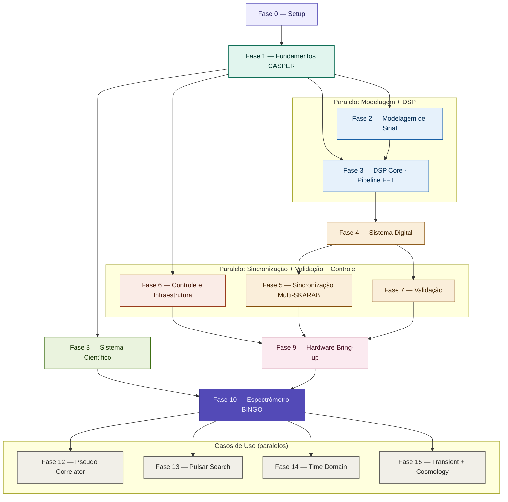

# BINGO Skarab PB

## Problem Description

The SKARAB (Square Kilometer Array Reconfigurable Application Board) is a superscale FPGA-based computing platform, designed by Peralex Electronics in South Africa, in collaboration with SARAO for radio astronomy. It is the successor to ROACH2, focused on high performance, low latency, and digital signal processing.

This device will be used as the BINGO backend. It is necessary to:
- Determine the signal processing required to achieve BINGO's science objective, namely cosmological observations of neutral hydrogen and transient phenomena.
- Determine data transport from SKARAB to a controller computer.
- Build a pipeline on the controller to ingest SKARAB data, control its behavior, and transmit data downstream.

## History

## Team

- UFCG
    - Luciano Barosi
    - Jordany Vieira
    - Tales
    - Gutemberg
    - DEE Student
    - João Vitor
- CHINA
    - Hector
- INPE
    - Cesar Strauss
    - Jorge

## Baseline

### Hardware

SKARAB BOARD
- FPGA Virtex-7 XC7VX690T
  - 690,000 logic cells
  - 3,600 DSP blocks
  - 53 Mb RAM
- ADC TI ADC32RF45
  - 14 bits
  - 3 GSps
- QSFP+ 40 GbE

### Science Requirements

- Bandwidth $\sim$ 400 MHz
  - Decimation: 8
- channels: 8192

### Available code

- GITHUB repository: https://github.com/BINGO-PB/BINGO_SKARAB_AI
  - This repository contains firmware and control scripts for the SKARAB platform used in the BINGO (Baryon Oscillation Spectroscopic Survey) radio telescope project. The firmware is designed to work with the SKARAB (Square Kilometre Array Reconfigurable Application Board) platform equipped with Virtex-7 FPGA and ADC mezzanine cards.
- GITHUB repository: https://github.com/BINGO-PB/bingo_skarab
  - This repository allows creating containers for developing a SKARAB control system with different library versions.

### Current best configuration

- spectrometer:
  - BW: 187.5 Mhz
  - channels: 32768
  - UDP
  - 40GB

## Challenges Encountered

## Action Plan

## Work Organization Decisions

:::{admonition} **Computers**
- **hven**: machine where *Matlab* and *Vivado* will be installed for bitstream development.
- **uirapuru**: dual boot Ubuntu 16.04 + Python 2.7, connected to SKARAB for control system development.
:::

:::{admonition} **Workflow**
- Stage 0/1 meetings - Tuesday 09:00 - ZOOM
- bi-weekly online alignment meetings
- 1-1 interactions for development and task completions
- Weekly individual short updates of progress and/or difficulties kept in GitHub.
- Task completion with small report, including validation procedure and fullfilment of requirements.
:::

### RoadMap 

:::{seealso} **Phase 0 — Computer Set Up**
:class: dropdown

#### Objectives
- Development environment setup
- Execution of basic CASPER examples

#### Tasks

- Environment setup on *hven*
  - Team: Tales + Arthur
  - Milestone: running `casper_fft.slx`

- Environment setup on *uirapuru*
  - Team: Tales + João Vitor
  - Milestone: CASPER tutorial 2

:::

:::{seealso} **Phase 1 — CASPER Fundamentals**
:class: dropdown

#### Objectives
- Team leveling
- Understanding CASPER + FPGA architecture

#### Tasks

- CASPER Tutorial 4
  - Milestone: Waterfall diagram

#### Essential Content

- FPGA Architecture (DSP slices, BRAM, routing)
- Fixed-point representation
- Processing pipeline
:::

:::{warning} **2 — Signal Modeling**
:class: dropdown

#### Objectives
- Build realistic models before hardware

#### Tasks

- ADC modeling
- Noise modeling
- RFI modeling
- Gain control (gain staging)
- DC removal

:::

:::{warning} **3 — DSP Core (FFT Pipeline)**
:class: dropdown

#### Objectives
- Spectrometer development in Simulink

#### Tasks

1. FFT
   - Aliasing
   - Scalloping loss
   - Spectral leakage

2. Windowing

3. Fixed-point strategy
   - Bit-width definition
   - Overflow policy (wrap vs saturate)

4. Decimation

5. FIR Filters

6. Dynamic Range and SFDR

7. Saturation and non-linearities

:::

:::{warning} **4 — Digital System**
:class: dropdown

#### Objectives
- Transform the DSP into a functional embedded system

#### Tasks

- Timestamping
- Packetization (40 GbE)
- Channel selection
- Buffering

:::

:::{warning} **5 — Synchronization and Multi-SKARAB**
:class: dropdown

#### Objectives
- Ensure temporal coherence and load distribution

#### Tasks

- Clock distribution
- Synchronization (PPS / GPSDO)
- Timestamp alignment
- Channel distribution across boards (probably not necessary)

:::

:::{warning} **6 — Control and Infrastructure**
:class: dropdown

#### Objectives
- Preparation for full pipeline development.

#### Tasks

- Bitstream upload via `progska`
- Upload via `casperfpga`
- Environment containerization
- Migration to Python > 3.8

#### DevOps

- Bitstream versioning
- Build parameter logging
- Logging and monitoring

:::

:::{warning} **7 — Validation**
:class: dropdown

#### Objectives
- Ensure consistency between model and hardware

#### Tasks

- Automated testbench
- Reference model in Python (NumPy)
- FPGA vs model comparison
- Synthetic signal injection

:::

:::{warning} **8 — Scientific System**
:class: dropdown

#### Objectives
- Translating scientific requirements into an operational system

#### Tasks

- Scientific requirements definition
- Translation to digital requirements
- Ingestion pipeline

#### Data Format

- HDF5
  - Structure with:
    - frequency
    - time
    - polarization
    - metadata

#### Data Transport
  - UDP, SPEAD, ...
  - metadata
:::

:::{warning} **9 — Hardware Bring-up**
:class: dropdown

#### Objectives
- Validation on real hardware

#### Tasks

- Internal loopback
- Test with tone generator
- Spectral verification
:::

:::{warning} **10 — BINGO Spectrometer**
:class: dropdown

#### Objectives
- Final scientific implementation

#### Requirements

- Validated DSP pipeline
- Functional digital system

:::

:::{warning} **11 — Scientific System**
:class: dropdown

#### Objectives
- Translating scientific requirements into an operational system

#### Tasks

- Scientific requirements definition
- Translation to digital requirements
- Ingestion pipeline

#### Data Format

- HDF5
  - Structure with:
    - frequency
    - time
    - polarization
    - metadata

#### Data Transport
  - UDP, SPEAD, ...
  - metadata
:::

:::{warning} **12 — BINGO Pseudo Correlator**
:class: dropdown

- 4 signals for each Skarab, 2 colfet and 2 polarizations.
:::

:::{warning} **13 — Use Case**
:class: dropdown

- Pulsar Search
:::

:::{warning} **14 — Time Domain**
:class: dropdown

- Assess the need to develop a time domain pipeline, for higher information during comissioning.
:::

:::{warning} **15 — Use Case - Transient + Cosmology**
:class: dropdown

- Realtime transient detection in `ms` data with buffer redirecting to further time integration or dedicated analysis of data segment. 
:::

## Roadmap Task Graph (Tentative)

