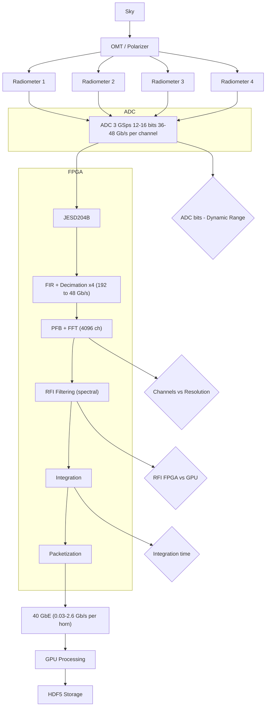
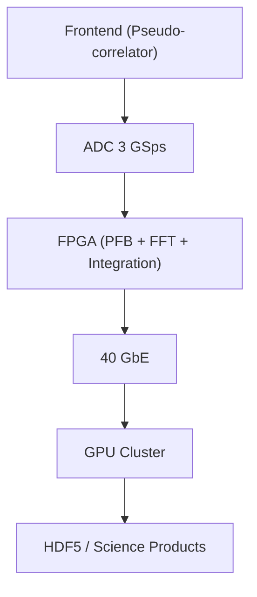
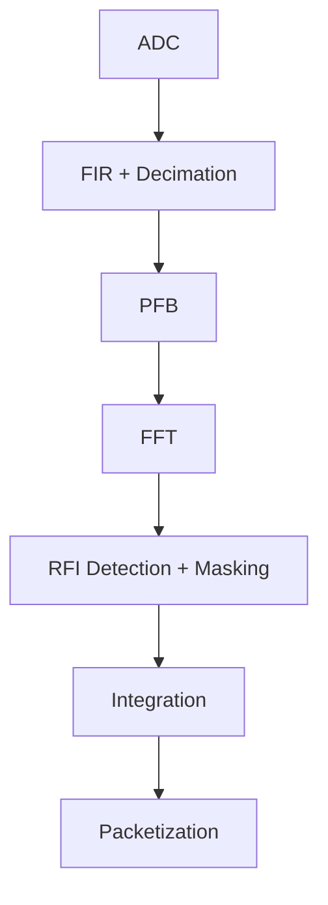
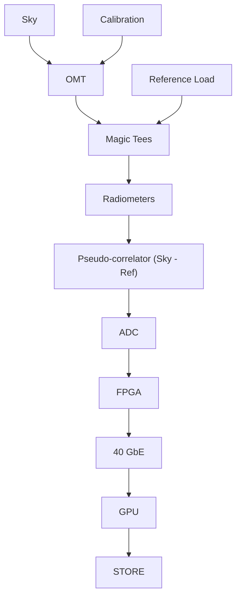
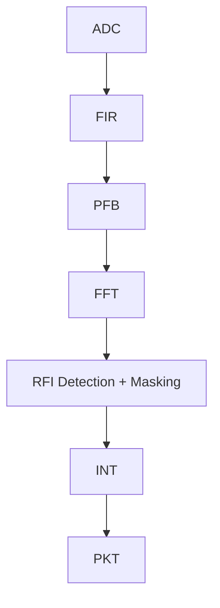

# Science Demand and Specifications

## System Overview Diagram

---

# Spectrometer

## 1. Overview

The BINGO acquisition system is based on a distributed architecture:

* **1 horn → 4 radiometers → 1 SKARAB (Virtex-7 XC7VX690T)**
* FFT-based spectrometer (F-engine)
* 40 GbE data transport
* GPU-based scientific processing

---

## System Chain

---

## 2. System Assumptions

| Parameter            | Value              |
| -------------------- | ------------------ |
| Number of horns      | 28                 |
| Radiometers per horn | 4                  |
| Total inputs         | 112                |
| Sampling rate        | 3 GSps             |
| Bandwidth            | 375 MHz            |
| FPGA                 | SKARAB (XC7VX690T) |
| Interface            | JESD204B           |
| Network              | 40 GbE             |

---

# 3. Data Rate Along the Chain

## 3.1 Per Horn

| Stage                          | Data Rate    |
| ------------------------------ | ------------ |
| Raw ADC (4 ch, 16-bit)         | 192 Gb/s     |
| After decimation (×4)          | 48 Gb/s      |
| After FFT + integration (1 ms) | **262 Mb/s** |

---

## 3.2 Full System (28 horns)

| Stage            | Data Rate      |
| ---------------- | -------------- |
| Input            | 5.4 Tb/s       |
| After decimation | 1.35 Tb/s      |
| Output (1 ms)    | **7.34 Gb/s**  |
| Output (10 ms)   | **0.734 Gb/s** |

---

# 4. FPGA DSP Chain

---

# 5. FPGA Resource Usage

| Resource   | Usage      |
| ---------- | ---------- |
| DSP slices | **80–85%** |
| BRAM       | **65–75%** |
| LUTs       | **50–70%** |

---

# 6. Quantization × Integration

| Bits | Integration | Data Rate / Horn | Total Rate | Dynamic Range (dB) | DSP (%) | BRAM (%) | LUT (%) |
| ---- | ----------- | ---------------- | ---------- | ------------------ | ------- | -------- | ------- |
| 12   | 0.1 ms      | 2.62 Gb/s        | 73.4 Gb/s  | 74                 | 70      | 60       | 50      |
| 12   | 1 ms        | 262 Mb/s         | 7.34 Gb/s  | 74                 | 70      | 60       | 50      |
| 12   | 10 ms       | 26.2 Mb/s        | 0.734 Gb/s | 74                 | 70      | 60       | 50      |
| 14   | 1 ms        | 262 Mb/s         | 7.34 Gb/s  | 86                 | 75      | 65       | 55      |
| 14   | 10 ms       | 26.2 Mb/s        | 0.734 Gb/s | 86                 | 75      | 65       | 55      |
| 16   | 1 ms        | 262 Mb/s         | 7.34 Gb/s  | 98                 | 80–85   | 70–75    | 60      |
| 16   | 10 ms       | 26.2 Mb/s        | 0.734 Gb/s | 98                 | 80–85   | 70–75    | 60      |

---

# 7. Operating Modes

## Survey Mode

* 14–16 bits
* 4096 channels
* 10 ms integration

→ **< 1 Gb/s total**

---

## Transient Mode

* 12–14 bits
* ≤0.1 ms

→ **>70 Gb/s (not sustainable)**

---

# Pseudo-Correlator

## Functional Diagram

---

## Impact on Dynamic Range

| Parameter              | Without pseudo-correlator | With pseudo-correlator |
| ---------------------- | ------------------------- | ---------------------- |
| DC offset              | High                      | Low                    |
| Required dynamic range | Moderate                  | **High**               |

---

# 8. RFI Filtering in FPGA

## Pipeline

---

## FPGA Cost (normalized)

| Block         | DSP (%) | BRAM (%) | LUT (%) |
| ------------- | ------- | -------- | ------- |
| RFI filtering | 5–8%    | 5–10%    | 5–10%   |

---

## Updated Total FPGA Usage

| Resource | Usage      |
| -------- | ---------- |
| DSP      | **80–85%** |
| BRAM     | **70–75%** |
| LUT      | **55–70%** |

---

# 9. Final Trade-off (with RFI in FPGA)

| Bits | Integration | Data Rate / Horn | Total Rate | Dynamic Range (dB) | DSP (%) | BRAM (%) | LUT (%) |
| ---- | ----------- | ---------------- | ---------- | ------------------ | ------- | -------- | ------- |
| 12   | 1 ms        | 262 Mb/s         | 7.34 Gb/s  | 74                 | 75      | 65       | 55      |
| 12   | 10 ms       | 26.2 Mb/s        | 0.734 Gb/s | 74                 | 75      | 65       | 55      |
| 14   | 1 ms        | 262 Mb/s         | 7.34 Gb/s  | 86                 | 80      | 70       | 60      |
| 14   | 10 ms       | 26.2 Mb/s        | 0.734 Gb/s | 86                 | 80      | 70       | 60      |
| 16   | 1 ms        | 262 Mb/s         | 7.34 Gb/s  | 98                 | 85      | 75       | 65      |
| 16   | 10 ms       | 26.2 Mb/s        | 0.734 Gb/s | 98                 | 85      | 75       | 65      |

---

# 10. Recommended Architecture

## Baseline

* Pseudo-correlator ✔
* **16-bit ADC**
* 4096 channels
* **10 ms integration**
* **RFI filtering in FPGA**

### Result:

* Total data rate: **~0.7 Gb/s**
* FPGA usage: **~85% DSP**
* High stability and robustness

