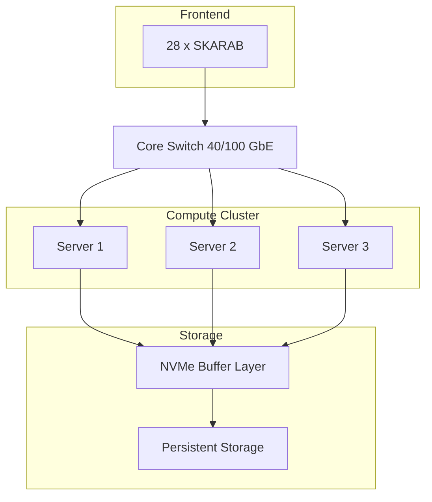
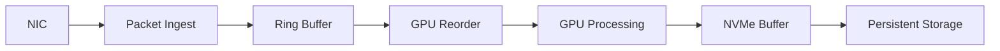

# BINGO Backend Cluster

---

# 1. Consolidated requirements

## Input

* 28 SKARAB (1 per horn)
* ~0.92 GB/s total (1 ms mode)
* ~450k packets/s

## Processing

* RFI filtering (refinement)
* calibration
* gridding
* map-making

## Storage

* up to **3.3 TB/h**
* need for buffering + persistence

---

# 2. Overall architecture

---

# 3. Compute nodes

**3 main nodes**

---

## Per-node configuration

### CPU

* 2× AMD EPYC / Intel Xeon
* **24–32 total cores**

---

### RAM

* **256 GB DDR4/DDR5**

---

### GPU

* **2× GPUs (A100 / RTX 4090 class)**

Distribution:

* GPU0 → ingest + reorder
* GPU1 → RFI + gridding

---

### NIC

* 1× 40 GbE (QSFP+)

---

### Local NVMe (buffer)

* 2–4 NVMe SSD
* 4–8 TB total
* RAID0 (performance) or RAID10 (safety)

---

# 4. Storage architecture

## Layer 1 — NVMe (buffer)

Function:

* absorb spikes
* decouple the pipeline
* allow replay

---

### Capacity

| Total NVMe | Buffer |
| ---------- | ------ |
| 4 TB       | ~1.2 h |
| 8 TB       | ~2.4 h |

---

## Layer 2 — Persistent storage

### NAS

* 100–500 TB
* RAID6

---

## Required throughput

* ≥ **1 GB/s sustained write**

---

# 5. Network

## Core switch

* 32× 40 GbE or 100 GbE
* ≥ 1 Tb/s switching capacity

---

## Layout

* all SKARAB units → switch
* all servers → switch

**star topology**

---

## Cabling

* DAC + fiber

---

# 6. Load distribution

### Horn-based split

| Server | Horns |
| ------ | ----- |
| S1     | 1–10  |
| S2     | 11–20 |
| S3     | 21–28 |

---

# 7. Internal pipeline (per server)

---

# 8. System capacity

## Compute

* required: ~100 GFLOPs
* available: **>100 TFLOPs**

---

## Network

* required: ~7 Gb/s
* available: 40–100 Gb/s

---

## Storage

* required: 3.3 TB/h
* critical → must be sized carefully

---

# 9. Bottlenecks

## 1. CPU ingest (packet rate)

## 2. RAM buffering

## 3. NVMe write consistency

## 4. synchronization between horns

---

# 11. Physical layout

## 1 typical rack:

* 1× switch (top-of-rack)
* 3× GPU servers
* redundant PDUs

---

## SKARAB:

* can be placed in a separate rack (frontend)

---

# 12. Order of magnitude (rough CAPEX)

| Item        | Qty     | Notes           |
| ----------- | ------- | --------------- |
| GPU servers | 3       | main cost       |
| GPUs        | 6       | high cost       |
| Switch      | 1       | 40/100 GbE      |
| NVMe        | 6–12    | buffer          |
| Storage     | 100+ TB | long term       |

---

# 13. Final configuration

## Initial cluster

* 3× GPU servers
* 1× switch 40/100 GbE
* 8–12 TB NVMe total
* 100+ TB persistent storage

---
