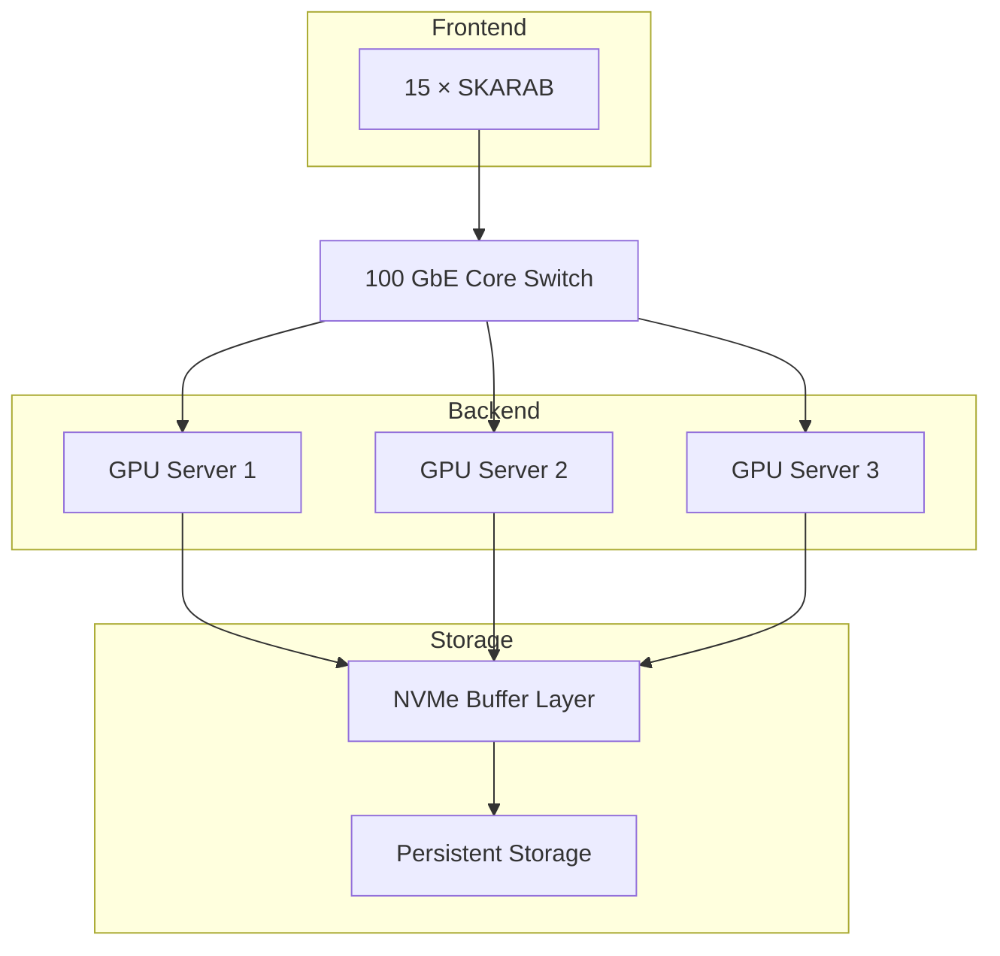
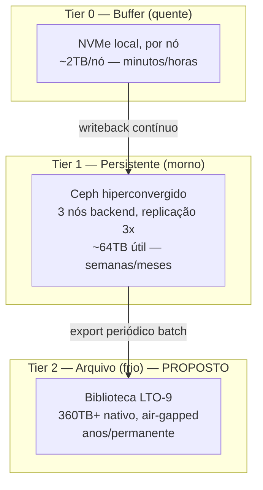
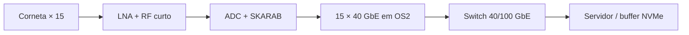

# BINGO Specifications and Needs

## Projetos Existentes com informações coligidas incompletas

- Arquivo `DES-EST-PB-IBRTEL-AGA-ASD-2024-R00-FL01_assinado` em uma pasta com nome `Projeto Executivo - Fundações BINGO-2024`.
    - Este é um projeto robusto, aparentemente diferente do projeto posterior. Quem pediu para fazer? Foi abandonado porque era muito mais caro? Porque as discussões sobre a necessidade de contenções e drenagens foram ignoradas?
    - O convênio com a FINEP foi assinado no dia 30/09/2024, o projeto foi produzido em junho de 2024, a FINEP pede o envio de um projeto, logo, **é razoável supor que este foi o projeto enviado a FINEP**.
    - O passado não volta, mas compreender as decisões, as razões e os responsáveis permite um planejamento eficaz para remediar alguma coisa que precise ser remediada, permite ter informações para responder a eventuais questionamentos e atuar junto a construção de forma a garantir o melhor resultado possível.
- Arquivo `01-EST-2025`na pasta `Projeto Estrutural Fundações` contém algumas plantas em `pdf` e um arquivo em `dwg`. É referido como *projeto executivo*, portanto, existem mais documentos que compõe o caderno. 
    - Os relatórios de vistoria se referem a este projeto, **é razoável supor que este foi o projeto executado**, portanto, é sobre este projeto que temos que ter o mais completo conjunto de informações. O projeto executivo deve ter uma parte textual, topografia, sondagem, memória de cálculo, plantas detalhadas, plantas de situação... isto é propriedade do contratante.
    - Longe do ideal não ter as respostas referentes ao primeiro item, mas este segundo item é imprescindível. Não se trata de pedir para fazer nada, se trata de solicitar um conjunto de documentos que já está pronto.
- Não tenho uma planta geral do sítio, tenho arquivos referentes ao radiotelescópio, mas o outro lado também é importante.
    - No convenio FINEP/FUNCATI deve ter um projeto referente ao outro lado, descrevendo o terreno, a casa, caixa dágua e usina solar. **Alex tem este material**.
- A Usina solar teve um projeto elétrico, alguém tem este projeto?
- Tenho vários arquivos `projeto da estrutura` produzidos na China. Infelizmente os arquivos `stp` estão corrompidos na minha pasta.
- Tenho várias pranchas da ponto de apoio sobre as estruturas, mas apenas `pdf`. Alguém tem os `dwg`?

## Data Center

### Premissas

- Élcio me informou hoje que serão 15 cornetas inicialmente, eu tinha na cabeça 28.
    - Já foi decidido como o plano focal será populado?
        - Do ponto de vista da ótica.
        - Do ponto de vista da estrutura.

- As premissas que estou utilizando são:.
    - Estou assumindo que teremos 1 skarab/corneta, recebendo 4 linhas RF, conectadas porta de 40GBE ao servidor.
    - Data Rate:
    $$
    \text{DataRate} = \frac{2 \times N_{\mathrm{pol}} \times  n_{\mathrm{bits}} \times n_\mathrm{fft}}{t_{\mathrm{int}} } = 262\; \mathrm{Mb/s}\\
    N_{\mathrm{pol}} = 2 \\
    n_{\mathrm{bits}} = 16 \\
    f_{\mathrm{samp}} = 3 \mathrm{GSa/s}\\
    n_\mathrm{dec} = 8 \\
    t_{\mathrm{int}} = 1 \mathrm{ms}\\
    n_{\mathrm{fft}} = 4096 \\
    \text{DataRate}_T = 3.9 \mathrm{Gb/s}
    $$
    - Operações nos dados: **ordenamento**, **RFI**, **Calibração**, **gridding**
        - estimativa de 200 operações por amostra: 
        $$
        N_\mathrm{flop} = \frac{N_\mathrm{out} \times n_\mathrm{fft} \times n_\mathrm{ops} \times n_\mathrm{horn}}{t_\mathrm{int}} \approx 50 \; \mathrm{Gflops}
        $$
        - Pipeline com Heimdall: 
        $$  N_\mathrm{flop} \approx 1 \mathrm{TFlops} $$

### Proposta de Layout

### Especificação

#### Servidores (3x)
| Item | Especificação | Preço médio (USD) | Subtotal (3x) |
|---|---|---|---|
| Servidor 2U dual EPYC |  | $11.500 | $34.500 |
| RAM DDR5 ECC | 256 GB/nó  | $2.100 | $6.300 |
| GPU — NVIDIA L4 24GB |  | $2.750 | $8.250 |
| NIC 40GbE QSFP+ |  | $600 | $1.800 |
| NVMe local (buffer) |  | $1.300 | $3.900 |
| Discos OSD Ceph | 4× HDD 16TB/nó  | $1.200 | $3.600 |
| HBA adicional | Para os discos OSD | $550 | $1.650 |
| Boot drives | 2× SSD 480GB RAID1 | $225 | $675 |
| **Subtotal nós** | | | **$60.675** |

#### Rede e infraestrutura

| Item | Preço médio (USD) |
|---|---|
| Switch NVIDIA Mellanox SN3700  | $9.843 |
| Switch gerenciamento 1GbE | $225 |
| Cabeamento (kit 15 SKARAB) | $900 |
| Rack | $700 |
| PDU redundante (2x) | $1.100 |
| **Subtotal rede/infra** | **$12.768** |

#### Storage

##### Storage Layout

### Custo Estimado **R\$450.000,00**

> 1U\$ = R\$5.30

>>> Servidores: **R\$300.000,00**
>>> Storage tape: \$10.400 20 cartuchos LTO-9 0 (cor(360TB nativo) -- **R\$55.120,00**

>>> Rede e infra: \$12.768 — switch SN3700, rack 24U -- **R\$67.670,00**

>>> **R\$450.000,00**

## Conexões RF

### Premissa

Cabos curtos de RF conectam receptores as Skarabs, próximas a torre e cabos de fibra ótica levam o sinal para casa de comando.

### Layout

### Espeificações

| Item                                              |            Qtd. | Faixa unitária |          Subtotal |
| ------------------------------------------------- | --------------: | -------------: | ----------------: |
| Cabos RF externos montados e testados             | 30 + 3 reservas |    US$ 100–200 |   US$ 3,3–6,6 mil |
| Gabinetes externos climatizados                   |               4 |    US$ 4–6 mil |     US$ 16–24 mil |
| Alimentação, quadro, DPS e distribuição           |          1 lote |              — |      US$ 8–15 mil |
| UPS online 6 kVA com bypass                       |               1 |    US$ 4–8 mil |       US$ 4–8 mil |
| Distribuição de clock e 1PPS                      |       1 sistema |              — |       US$ 5–8 mil |
| QSFP+ 40G LR4/IR4                                 | 30 + 4 reservas |    US$ 300–600 | US$ 10,2–20,4 mil |
| Tronco OS2 externo de 48 fibras instalado         |       200–250 m |              — |      US$ 8–20 mil |
| DIOs, caixas, pigtails, emendas e patch cords     |          1 lote |              — |       US$ 3–5 mil |
| Rede de gerenciamento 1 GbE                       |          1 lote |              — |     US$ 1,5–3 mil |
| Monitoramento ambiental e elétrico                |     4 gabinetes |              — |       US$ 2–4 mil |
| SPDA, equipotencialização e proteção complementar |          1 lote |              — |       US$ 3–6 mil |
| Comissionamento RF/óptico/sincronismo             |       1 serviço |              — |      US$ 8–12 mil |

### Adicionais na Casa de Comando

| Item                                        |   Qtd. |      Subtotal |
| ------------------------------------------- | -----: | ------------: |
| Ópticos/DACs do uplink                      |    2–4 |   US$ 1–3 mil |

### Detalhamento 

- quatro gabinetes climatizados distribuídos verticalmente;
- três ou quatro SKARABs por gabinete;
- cabos RF limitados preferencialmente a 5 m, admitindo até 8–10 m;
- um alimentador elétrico principal com quatro ramais protegidos;
- clock e PPS distribuídos opticamente;
- um tronco OS2 de 48 fibras;
- enlaces 40GBASE-LR4/IR4 ponto a ponto;
- switch de agregação na casa de comando;
- 2×100 GbE entre switch e servidor;
- rede 1 GbE separada para controle;
- quatro QSFP+ sobressalentes, dois em cada extremo lógico;
- pelo menos uma fonte, uma unidade de climatização crítica e uma SKARAB/ADC de reserva.

### Climatização: **18.000 BTU**

### Estimativa de Custo **R\$800.000,00 -- R\$1.000.000,00**

## Despesas Adicionais

- Inteligencia Artificial: R\$150,00 x 12 **(R\$1.800,00)**
- Canva Pro:  R\$35,00 x 12  **(R\$420,00)**
- Adobe Creative Cloud: R\$100,00 x 12  **(R\$1.200,00)**
- Projeto executivo (difícil dizer) **R\$500.000,00**

| Bloco                                       | Escopo                                                                                                     | |
| ------------------------------------------- | ---------------------------------------------------------------------------------------------------------- | -----------------------: |
| 1. Diagnóstico técnico-documental           | Auditoria dos projetos, contratos, memoriais, ARTs, desenhos, medições, alterações e obras executadas      |
| 2. Levantamento cadastral “as built”        | Topografia de precisão, escaneamento, cadastro das estruturas, fundações, instalações e interferências     |   
| 3. Investigações e ensaios complementares   | Geotecnia localizada, concreto, soldas, parafusos, revestimentos e materiais                               |     
| 4. Verificação das estruturas existentes    | Reanálise de fundações, torres, estruturas metálicas, estabilidade, vento, tolerâncias e não conformidades |
| 5. Projetos executivos civis remanescentes  | Acessos, drenagem, contenções, edificações, urbanização e instalações incompletas                          |
| 6. Projetos elétricos e utilidades          | Energia, subestação, gerador, UPS, distribuição, climatização, incêndio e hidráulica                       |     
| 7. Aterramento, SPDA e EMC/RFI              | Malha, equipotencialização, surtos, compatibilidade eletromagnética e critérios de aceitação               |      
| 8. Telecomunicações, segurança e automação  | Fibra, dutos, racks, controle, CFTV e supervisão                                                           |        
| 9. Coordenação geral e compatibilização BIM | Modelo federado, interfaces, gestão documental e coordenação das disciplinas                               |      
| 10. Orçamento e documentação para conclusão | Quantitativos, composições, cronograma, caderno de encargos e critérios de medição                         |          

## Notas sobre o Orçamento para Comissionamento do BINGO

### 1.2 Computador

- Notebooks foram vetados

| Componente | Custo (US$) | Custo Brasil (R$) |
|---|---|---|
| CPU (EPYC 9354, 32c) | 2.000 – 2.200 | 16.000 – 22.000 |
| Placa-mãe (SP5) | 700 – 1.000 | 6.000 – 9.000 |
| RAM 256GB DDR5 ECC | 4.000 – 7.000 | 40.000 – 60.000 |
| GPU computação (L4 24GB) | 2.500 – 3.500 | 20.000 – 28.000 |
| GPU vídeo dedicada (DisplayPort) | 450 – 650 | 3.500 – 5.500 |
| NVMe 1TB enterprise | 130 – 180 | 1.200 – 1.800 |
| Disco >10TB (HDD Enterprise) | 300 – 400 | 2.800 – 3.800 |
| Fonte (~850-1000W, bem mais tranquila agora) | -- | -- |
| Gabinete + refrigeração (ar, sem precisar de líquido) | 250 – 500 | 2.200 – 4.000 |

**R\$110.000**

### 3. Minicornetas

Eu reduziria os quantitativos

- Chapas de Alumínio: 5 chapas
- Tubos: 5
- SDR Pluto -> RTLSDR v5

#### Total **R\$5.000,00**

### Storage e rede

1. O item 1 não é realista, switch e NIC não vai sair por est preço. Nós temos o suficiente para utilizar em laboratório, deve focar na aquisição para o datacenter. Estimativa R$67.000,00
2. Storage para o data center estimado em R\$50.000,00
3. LTO-9 é para armazenamento frio, é melhor priorizar o início da operação e atribuir prioridades aos itens que não são estritamente necessários. **PRIORIDADE 1**
4. Tem que dimensionar o projeto. A estimativa acima é bem superior, sai do escopo deste recurso.
5. Movimentação de cornetas não é essencial para início da operação. **PRIORIDADE 2**
6. Sistema de Metrologia: não é necessário para o início da operação, só faz sentido se item 5 é incluído, mas não é item imprescindível. **PRIORIDADE 3**
7. Thaco: R\$125.000,00
8. Passagens e diárias 40.000,00
9. Publicação R$0,00 (cortado)
10. Visitas ao sítio R$27.000,00
11. Rubidium Frequency Standard +GNSS R$60.000,00
12. Estação metereológica R$20.000,00
