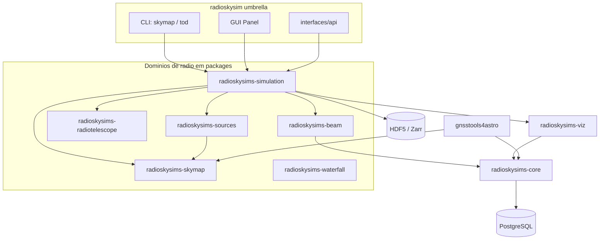

# RadioSkySimSuite

## Visão geral

É o *meta-repo* da colaboração BINGO para **simulação e análise do céu de rádio
visto por um radiotelescópio single-dish em modo de trânsito**. O sistema modela
o feixe (padrões analíticos e CSV), a geometria do apontamento, satélites a
partir de TLEs (Skyfield), fontes locais (Sol) e catálogos de radiofontes
ingeridos por TAP/astroquery (NVSS, Specfind) e, a partir disso, **sintetiza
TOD** (*Time Ordered Data* — temperatura de antena) com processamento consciente
de memória, além de **gerar e analisar mapas HEALPix** (Healpy, PySM3, HiPS).

O projeto segue **arquitetura hexagonal (Ports & Adapters)** e foi desacoplado
de um monólito em **9 distribuições independentes** em `packages/*` (submódulos
git) gerenciadas como **uv workspace**, com o pacote raiz `radioskysim` reduzido
a *composition root* + CLI/GUI + extras seletivos.

## Funcionalidades

- **TOD** — síntese de *Time Ordered Data* com orquestrador configurável,
  batches e controle de memória (Dask, inclusive cluster *distributed*).
- **SkyMap** — geração, transformação e análise de mapas HEALPix; providers
  Healpy/PySM3/HiPS e repositório HDF5.
- **Beam** — domínio de feixe, loaders e painel de visualização.
- **Fontes** — satélites GNSS, fontes locais (Sol) e catálogo de radiofontes
  (TAP/astroquery, VIZIER, NVSS/Specfind).
- **Waterfall** — pacote autônomo de visualização tempo × frequência.
- **Interfaces** — CLI `radioskysims` (`skymap`, `tod`, `tod jobs`), CLIs de
  pacote (`radioskysim-sources`, `gnss4astro`), fachada de notebook e GUI Panel.
- **Persistência** — PostgreSQL (SQLModel/SQLAlchemy) via docker compose, com
  datasets em HDF5 (`h5netcdf`) ou Zarr.

## Planejado / pendente

- **F1 — UX dos entrypoints**: ruído de *startup*, `--telescope` padrão quebrado
  no primeiro uso, formatadores/cores, `--help` completo, unificação dos três
  CLIs.
- **F2 — Dívida DDD/engenharia**: violações de camada
  `application → infrastructure` e `domain → application`; refatoração
  incremental dos módulos grandes (`sim_orchestrator.py`, `simulation.py`,
  `resource_processor.py`).
- **F3 — Evoluções científicas**: *waterfall* com eventos, TLE vs RINEX,
  ingestão NVSS, banda completa PySM3.
- **Release** `dev → main` (PR de release ainda pendente; `main` = baseline
  inicial).
- Padronizar a localização de dados/plots (`data/`, `notebooks/plots/`).

## Tech stack

| Camada | Tecnologias |
|---|---|
| Linguagem / build | Python 3.11–3.14; uv workspace; Hatchling + hatch-vcs; MIT |
| Arquitetura | Hexagonal (ports & adapters), 9 pacotes, composition root |
| Dados científicos | xarray + Dask, NumPy, SciPy, Astropy, astroquery, Skyfield, SGP4, georinex |
| Sky / mapas | healpy, PySM3, pyccl, camb, reproject, cartopy |
| Modelagem / persistência | Pydantic v2, SQLModel, SQLAlchemy, PostgreSQL, HDF5/h5netcdf, Zarr |
| Visualização | Panel, HoloViews, hvplot, Datashader, jupyter-bokeh, Matplotlib |
| Qualidade | pytest, ruff, mypy, Sphinx + MyST + Mermaid, GitHub Actions (CI) |

## Maturidade

O metadado do pacote declara `Development Status :: 1 - Planning`, mas o
repositório está bem além disso: **~58 mil linhas de produção em 437 arquivos**
(mais ~31 mil linhas de teste), **~1.700 funções de teste estáticas**, CI verde
(lint + testes do meta-pacote e dos pacotes) e arquitetura em camadas
formalizada em `docs/architecture/`.

É a base **mais abrangente e volumosa** do conjunto — *alpha avançado / beta em
preparação* —, com dívida técnica e de UX documentada e rastreável (frentes
F1/F2/F3) e o release inicial ainda não fechado.

## Arquitetura

