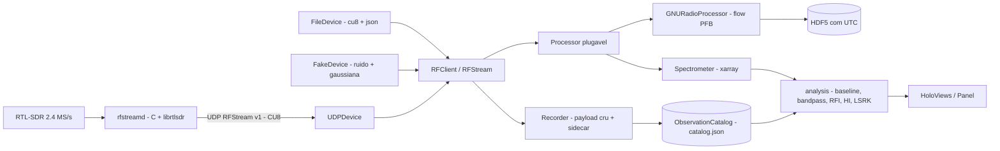

# minicorneta_cz — `rfstream` v1.0.0

## Visão geral

Stack mínima e completa de **aquisição, transporte e análise de RF** para a
bancada de baixo custo: Raspberry Pi 3B+ + RTL-SDR a 2,4 MS/s, com o daemon
`rfstreamd` em **C** lendo CU8 nativo e enviando datagramas UDP, e um cliente
Python enxuto (`RFClient`) com *backends* UDP, arquivo e **fake** (ruído branco
+ sinal gaussiano). Sobre essa base vivem a gravação reproduzível de
observações, o **espectrômetro** (IQ → *waterfall*/espectro em xarray), as
*baselines* (`polynomial`, `median`, `arpls`, `cold`) e a análise científica de
**HI 21 cm** (frequência → velocidade, LSRK).

A fase mais recente integra um **fluxo GNU Radio headless** (canalizador PFB,
sem Qt) gravando HDF5 com timestamps UTC absolutos, e scripta a **campanha de
calibração** *warm-up / hot / cold / sky* para as duas polarizações.

## Funcionalidades

- **Aquisição** — `RFClient` com máquina de estados explícita, `status()`
  estruturado e o mesmo API para fake/hardware; `observe(duration=...)` grava o
  payload cru + *sidecar* JSON com memória independente da duração.
- **Medições nomeadas** — `ObservationCatalog` (índice atômico `catalog.json`,
  `sync()`, `spectrum(name)`) e calibração *hot/cold* (`method="cold"`) com
  resultado em temperatura (K).
- **Processador plugável** — `processor="built-in"` (gravação crua),
  `Spectrometer` ou `GNURadioProcessor(flow=..., output=...)`.
- **Fluxo ao vivo** — `python/gnuflow/minicorneta.py` (PFB de 5 canais,
  fontes `noise`/`file`/`feeder`) → HDF5 com `frequency`/`power`/`timestamps`
  (UTC)/`n_spectra`.
- **Análise de banda** — `remove_peaks` (picos relativos à mediana móvel),
  `bandpass_response` (resposta instrumental) e `bandpass_window` (banda útil a
  90 % da mediana); RFI e visualização HoloViews/Panel (MHz + marca do HI).
- **Sem hardware** — `rfstream-fakeserver` + `examples/remote_fake_xarray.py`;
  `make flow-check` valida o caminho app → flow → HDF5.

## Planejado / pendente

- **Fase 7 (hardware)** — campanha de validação de campo ainda pendente; o
  código está pronto e o *bring-up* de 60 s passou com **0 pacotes perdidos**.
- Pós-v1.0, adiados por ordem de valor: *waterfall* ao vivo em Panel;
  espectrogramas *chunked* com Dask para horas de observação; **calibração de
  ganho** para unidades físicas absolutas; produtos de polarização/canal duplo;
  timestamps GPS/PPS.

## Tech stack

| Camada | Tecnologias |
|---|---|
| Núcleo | Python ≥ 3.10; NumPy (dependência única do núcleo) |
| Daemon | C + `librtlsdr`; systemd (`rfstreamd.service`); Makefile de deploy |
| Protocolos | RFStream v1 binário sobre UDP (CU8, *sequence*/`sample_index`); controle JSON *newline-delimited* em TCP |
| DSP / fluxo | GNU Radio 3.10 (PFB channelizer); FFT/PSD em NumPy |
| Dados | xarray (espectro/waterfall), h5py (produtos HDF5) |
| Ciência | Astropy (LSRK), HI 21 cm, `arpls` (Baek 2015, sem SciPy) |
| Visualização | HoloViews + Panel (extras `viz`/`notebook`) |
| Qualidade | pytest, ruff (pinado `>=0.16.9,<0.17`); extras `dev`/`xarray`/`hdf5`/`viz`/`astro` |

## Maturidade

O projeto mais **fechado e auto-consistente** do conjunto: **roadmap fases 0–10
concluídas**, ~14 mil linhas Python (mais o daemon em C), **~218 funções de
teste**, lint e formatação limpos e validação de ponta a ponta contra hardware
real (60 s a 2,4 MS/s, 288 MB de UDP, **0 pacotes perdidos**).

Nível **v1.0** — maduro para o escopo proposto. A ressalva honesta é que a
campanha de hardware em campo ainda não foi encerrada, e o diretório não tem
remoto git configurado neste clone.

## Arquitetura

