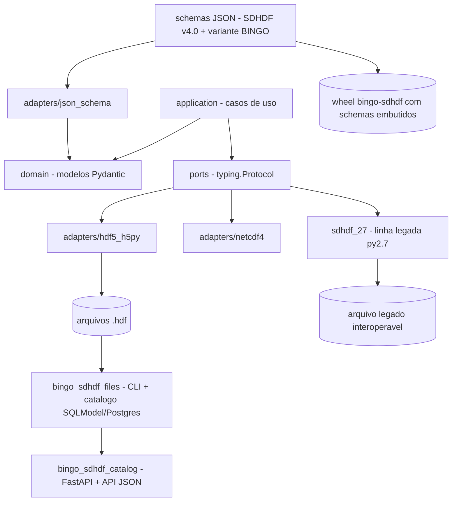

# BINGO_SDHDF

## Visão geral

Motor **schema-driven** para **ler, escrever, validar e inspecionar** arquivos no
padrão **SDHDF v4.0** (*Spectral-Domain Hierarchical Data Format*), construído
para a colaboração BINGO. Toda a hierarquia de grupos/datasets/atributos vive em
**schemas JSON** validados em tempo de execução com Pydantic, permitindo
**variantes (ex.: BINGO) por composição/overlay em vez de *fork*** — a estrutura
pode ser customizada sem tocar no código do motor.

Mantém **duas linhas de produto interoperáveis no nível do arquivo**: a moderna
`bingo_sdhdf` (Python ≥ 3.11, ativa) e a **`sdhdf_27` congelada e compatível com
Python 2.7**. É hoje um motor/biblioteca **standalone**: as aplicações de
aquisição (Uirapuru) foram movidas para repositório próprio e consomem este
pacote como dependência.

## Funcionalidades

- **Ciclo completo** — criação, leitura, escrita, validação e introspecção de
  arquivos SDHDF v4.0, com variante BINGO (`schemas/bingo_sdhdf_v1.0.json`).
- **Payloads lazy** — *waterfalls* grandes expostos como `LazyDataset` até serem
  requisitados; leitura *eager* a uma flag de distância.
- **Proveniência** — `history` e `software_versions`; metadados de arquivo
  (`FILE_CREATED`, `FILE_SIZE`, `UTC_START`/`UTC_END`).
- **Escrita robusta** — *chunked* (`SdhdfRecordSink`, com uma linha de
  `history` por *chunk*), compressão **gzip/bitshuffle** preservada no
  *read-modify-write* e escrita paralela **MPI** (*best-effort*, `make env-mpi`).
- **Export opcional** — adaptador **netCDF4**.
- **Linha legada** — `sdhdf_27` (py2.7 + 3.x), congelada mas interoperável.
- **Aplicações satélites** — `bingo_sdhdf_files` (CLI `bingo-sdhdf-files run`,
  hashes SHA-256 de bitstream/diagrama, catálogo SQLModel/PostgreSQL) e
  `bingo_sdhdf_catalog` (**FastAPI + Jinja2**, API JSON `/api/v1`, login por
  sessão).

## Planejado / pendente

- **Fase 10 — validação BINGO & rollout**: validar contra dados reais (não só o
  *template* vazio), *pilot* com a colaboração e *handover* (maintainers,
  triagem de issues, canal de suporte).
- **Fase 11 (restante)**: CI com PostgreSQL descartável, ALT/AZ por *beam*,
  política de reabertura de produto, *connection pooling*, consumidor do *loop*
  de aquisição.
- **Fases 12–13 (restante)**: *parser* **SPEAD real**, validação em
  SKARAB/FPG e supervisão por systemd (hoje no repo UIRAPURU); *writer*
  paralelo multiprocesso.

## Tech stack

| Camada | Tecnologias |
|---|---|
| Linguagem / build | Python 3.11–3.13; Hatchling; BSD-3-Clause; `schemas/` embutidos no wheel |
| Validação | **Pydantic v2** + schemas JSON (fonte única da verdade) |
| Arquitetura | Hexagonal com `ports` em `typing.Protocol` e *composition root* (`factory.py`) |
| Armazenamento | **h5py** (backend HDF5, *dimension scales*), compressão gzip/bitshuffle, MPI/mpio; netCDF4 opcional |
| Aplicações | FastAPI + Jinja2 (GUI), SQLModel + Alembic + PostgreSQL (catálogo), Typer/CLI |
| Qualidade | ruff, mypy, pytest (+ `--cov`), pre-commit, GitHub Actions (matriz 3.11/3.12/3.13) |
| Docs | mkdocs-material + ADRs (0001–0008) e rastreabilidade de requisitos |

## Maturidade

Declara-se **Pre-Alpha (0.1.0)**; as fases 0–9 e 11–13 já foram entregues com
**~185 testes (226 funções `test_*`)**, **CI completo (ruff + mypy + pytest em
três versões)**, documentação publicável (mkdocs), ADRs e *sdist*/wheel com os
*schemas* embutidos.

É um **motor de formato sólido e testado**, mas com as fases de **validação com
dados reais e *rollout* em aberto** — *pre-alpha avançado*, biblioteca estável
em uso interno.

## Arquitetura

