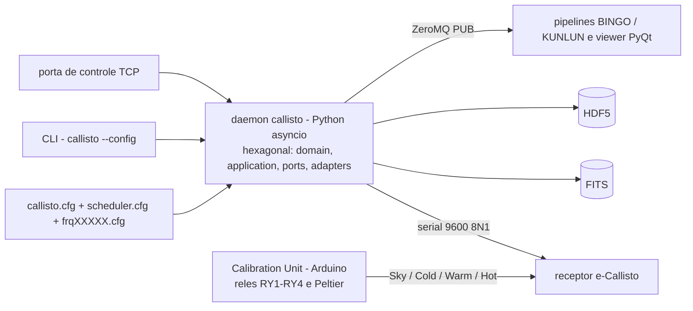

# pyCallistoSpectrometer — `callisto_reborn`

## Visão geral

Substitui o daemon C original dos receptores **e-Callisto** por um **daemon
Python assíncrono**, mantendo a compatibilidade do protocolo serial e dos
arquivos de configuração legados (`callisto.cfg`, `scheduler.cfg`,
`frqXXXXX.cfg`). O software é organizado em **arquitetura hexagonal**
(`domain` / `application` / `ports` / `adapters`), escreve os produtos em
**FITS** e **HDF5** com cabeçalhos definidos a partir de templates JSON e, de
forma opcional, publica cada quadro por **ZeroMQ PUB** para pipelines a jusante
(BINGO/KUNLUN) e *viewers* em tempo real.

O `callisto_reborn` é a metade de **hardware**: a **Calibration Unit** em Arduino
(também reescrita/reverse-engineered) que comuta, por relés e Peltier, entre
**céu, antena A2 (referência fria), fonte morna e fonte quente**, dando ao
receptor a referência necessária para a calibração.

## Funcionalidades

- **Daemon** — `callisto --config <arquivo>`; runtime assíncrono que valida o
  *handshake* serial e recusa entrar em RUNNING se o hardware não responde
  (motivo no `callisto.log`).
- **Modos de medição** — Stop/idle, **calibração (2)**, **gravação contínua (3)**
  e **OV — spectral overview (8)**, além dos códigos de foco/FPU (LHCP, RHCP,
  polarizações lineares, fontes de ruído de 10 a 30 dB ENR, Peltier, gases
  criogênicos).
- **Escritores** — FITS e HDF5 com cabeçalhos gerados de
  `docs/fitsheader.json` e `docs/hdf5atrrbs.json`.
- **Streaming** — `ZmqPublisher` (PUB) com *frame layout* documentado; exemplo
  de cliente GUI (`examples/zmq_viewer.py`, PyQt5 + pyqtgraph).
- **Agendamento** — scheduler compatível com os `scheduler.cfg` legados.
- **Unidade de calibração (hardware)** — matriz de relés RY1–RY4
  (`Sky`, `Antenna A2 – Cold`, `Hot`, `Warm`), comandos `Tcold`, `Tsky`,
  `Twarm`, `Thot`, `Pheat`/`Pcool`/`Poff`, `con0`/`con1`, `Tnom`, `Ttol`, `UR`,
  `tcu`, `U28`, `V?`, `RESET`; comunicação 9600 8N1.

## Planejado / pendente

- **API HTTP/REST** (`src/callisto/api/`) — diretório reservado para uso futuro.
- **Notebooks científicos** — previstos na estrutura, ainda vazios.
- **Firmware da Calibration Unit** — o `.hex` queimado estava corrompido; há
  uma versão corrigida obtida por *reverse engineering*
  (`calibration_fixed.bin/.hex`), com `cal_working.md` documentando os comandos
  que respondem.
- Integrar a comutação da unidade de calibração ao caminho da aplicação (no
  legado isso vivia em um `TCPSerialClient`).

## Tech stack

| Camada | Tecnologias |
|---|---|
| Software | Python ≥ 3.10; `pyserial` + `pyserial-asyncio`; Pydantic v2 / pydantic-settings; `pyzmq` (extra); astropy; h5py; NumPy; pytest |
| Arquitetura | Hexagonal (`domain`/`application`/`ports`/`adapters`), com fachadas de compatibilidade no topo do pacote |
| Produtos | FITS e HDF5 com templates JSON de cabeçalho; *stream* ZeroMQ PUB |
| Hardware | Arduino (C++): `Calibration_Unit.ino`, `CtrlRelais_V1.ino`; conversão/RE de firmware em Python (`extract_hex.py`, `reverse_engineering.py`) |
| Instrumento | Receptor e-Callisto, faixa 45–870 MHz, FI2 10,7 MHz, LO 27 MHz |

## Maturidade

O pacote declara **1.0.0** e `Development Status :: 5 - Production/Stable`
(MIT), com **13 arquivos de teste / 25 funções** e 21 commits — ou seja,
**estável e completo no escopo do daemon**, embora a suíte seja pequena para o
rótulo de *Production/Stable*.

O lado de hardware está **validado em bancada**: a tabela de relés e os comandos
de calibração funcionam conforme o `cal_working.md`. O que resta é o firmware
corrigido (o original está corrompido) e a integração do comutador ao fluxo de
observação.

## Arquitetura

