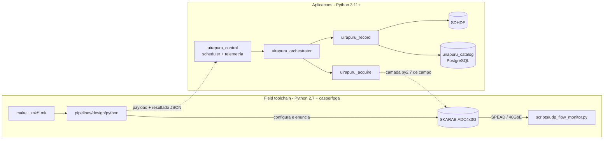

# UirapuruTelescope

## Visão geral

Software do radiotelescópio **Uirapuru** (colaboração BINGO em Paraíba — sítio a
−7,27° / −36,83°, 550 m), cujo backend é uma placa **SKARAB** (CASPER, Virtex-7
com mezaninas ADC4x3G) que digitaliza o sinal e emite o espectrômetro como
*stream* **SPEAD** por 40GbE. O repositório faz três coisas: **configurar**
(firmware, ADCs, clock, acumulação, destino do *stream*), **adquirir** (enunciar
o caminho de dados, receber o *stream* e produzir arquivos **SDHDF**) e
**registrar** (qual bitstream, qual mapa de registradores, qual configuração
efetiva e quais produtos, com *hashes*).

O repositório guarda **dois stacks** deliberadamente separados: a **ferramenta
de campo** validada (**Python 2.7 + `casperfpga`**), que é o que roda na placa
hoje, e as **aplicações do telescópio** (destino da migração: Python 3.11+,
hexagonal, catálogo SQLModel/Alembic). Eles se encontram em uma **costura
explícita** — o contrato JSON de resultado do script de aquisição e os
relatórios de sessão — para que a migração não pare o trabalho de campo.

## Funcionalidades

- **Ferramenta de campo** — `make <target>` + `mk/*.mk`; `skarab_read_versions`
  (8 campos do manual POP-SKARAB-ADC-001), `fpg_registers_doc` (parsing do
  `.fpg` por AST → `pipelines/yaml/<design>.yaml`), `udp_flow_monitor.py`
  (descobre o SPEAD e resume em JSON), `make session` (relatório
  `data/sessao_<UTC>.json`) e a rede de instrumentos (DHCP + NAT em
  `192.168.10.0/24`).
- **Aplicações** — `uirapuru_control` (scheduler, máquina de estados,
  *launcher* local/ssh, telemetria/métricas, CLI com as operações da SKARAB),
  `uirapuru_acquire` (receptor SPEAD; camada SKARAB no subconjunto py2.7+py3;
  fontes BRAM/SPEAD; transporte UDP ou *unix socket*), `uirapuru_record`
  (receptor → **SDHDF**, com escrita *chunked* e registro do produto) e
  `uirapuru_orchestrator` (sobe e derruba na ordem certa).
- **Catálogo** — `uirapuru_catalog` (CLI `uirapuru-catalog`): inventário de
  sítios, *facilities*, projetos, pessoas, *runs*, produtos e proveniência.
- **Evidência de campo (2026-09-20)** — ADC configurado (DDC 1120 MHz pelo
  script do INPE), `acc_cnt` avançando, **SPEAD v4** chegando a `10.10.20.1`
  (72,4 kB/pacote; 19,7 MB/s na sessão automatizada e 60,7 MB/s na receita do
  INPE; picos de ~36,8 dB em 970–1107 MHz nas BRAMs).

## Planejado / pendente

- Fechar a compatibilidade do venv de campo (faltam `matplotlib`/`fitsio`; o
  `progska.so` exige GLIBC 2.33 e precisou ser recompilado na bingo-02).
- Padronizar o `/share` na máquina ligada à SKARAB (hoje o *runner* sincroniza
  por `scp`).
- Expor as operações de controle da SKARAB na CLI do `uirapuru-telescope`
  (verbo existe, falta o *wrap* do lado do *telescope*).
- Documentar a console serial; **parser SPEAD real** e validação de hardware
  do payload; leitura de metadados SDHDF para o catálogo (extra opcional).

## Tech stack

| Camada | Tecnologias |
|---|---|
| Aplicações | Python ≥ 3.11; uv workspace + Hatchling; Typer (CLI) |
| Arquitetura | Hexagonal por projeto (ports em `typing.Protocol`, *composition root*), ADR-0007/0010/0011 |
| Catálogo | SQLModel + Alembic + PostgreSQL (`psycopg` no extra `db`) |
| Aquisição | `spead2` (SPEAD-64-48/INAF), sockets UDP e *unix*; PyYAML (perfis de dispositivo) |
| Produtos | **bingo-sdhdf** (motor SDHDF) via `bingo-sdhdf-files[db]` |
| Campo | Python 2.7 + `casperfpga` (fork Peralex), `make`, DHCP/NAT (`dnsmasq` + `nftables`), 40GbE |
| Qualidade | pytest (+cov), ruff, mypy, pre-commit; mkdocs + ADRs; GitHub Actions |

## Maturidade

Ambos os pacotes estão em **0.1.0**, mas a ferramenta de campo é
**validada no hardware real** (sessão de aquisição de 2026-09-20) e as
aplicações têm **~300 funções de teste**, lint/type-check e CI, além de CI de
arquitetura (teste que proíbe imports entre camadas).

Nível: **protótipo maduro em produção de campo** — ~23,6 mil linhas Python em
`src/`, dois stacks convivendo com uma costura pequena e explícita, migração
Python 2.7 → 3.11+ em curso.

## Arquitetura

