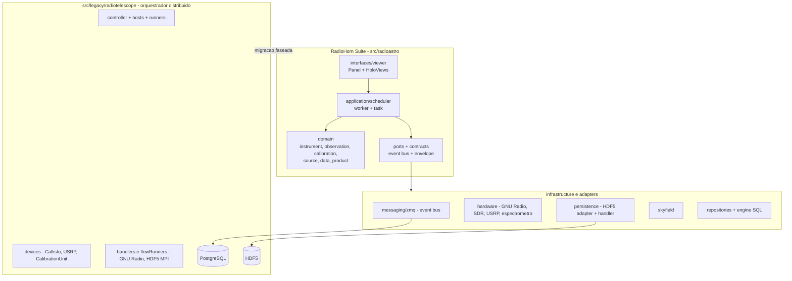

# RadioHorn

> Repositório: `barosil/Minihorn` — a suíte de radioastronomia do Minihorn: o
> espectrômetro GNU Radio/USRP, o **RadioHorn Suite** (`src/radioastro`, a nova
> arquitetura DDD/hexagonal) e o orquestrador legado `src/legacy/radiotelescope`.

## Visão geral

É o projeto que reúne o **espectrômetro Minihorn** (GNU Radio + USRP, com
gravação HDF5 e visualizador científico) e o **RadioHorn Suite**, a
**reescrita com Domain-Driven Design e Ports/Adapters** do orquestrador de
observações distribuído que existia em `radiotelescope`. No legado, um *Worker*
central coordenava **múltiplos hosts e *devices*** (receptor Callisto, USRP e a
**Calibration Unit**), pipelines GNU Radio, escrita HDF5 com MPI e persistência
PostgreSQL; o RadioHorn mantém esse escopo, mas com domínios ricos
(*instrument*, *observation*, *calibration*, *source*, *data_product*),
contratos claros entre camadas e um **broker de eventos ZMQ** para orquestração.

O repositório carrega ainda o livro **“Introdução à Radioastronomia”** (MyST) e
a análise de migração legado → RadioHorn, que mapeia cada conceito do código
antigo para o seu destino na nova arquitetura.

## Funcionalidades

- **Espectrômetro Minihorn** — *flowgraph* GNU Radio + USRP/UHD; FFT com janelas
  e integração configuráveis; HDF5 com metadados astronômicos e compressão LZF;
  monitoramento em tempo real, métricas, alertas; **fonte simulada (DummySource)**
  para desenvolvimento sem hardware; CLIs `minihorn-run` e `minihorn-viewer`.
- **Visualizador científico** — Panel + HoloViews: *waterfall* interativo,
  *light curves* e *spectrum slices* por clique, subtração de *baseline*
  (**ARPLS**), suavização, **detecção de RFI (MAD)** e coordenadas galácticas
  com mapa Mollweide.
- **RadioHorn Suite** (`src/radioastro`) — domínio (instrumento, observação,
  calibração, fontes, produtos de dados, processamento, *value objects* como
  `FrequencyRange`, `AngularRange`, `TimeRange`, `Observatory`); scheduler
  (`worker`, `task`, `scheduler`); adaptadores de hardware (GNU Radio, SDR,
  USRP, espectrômetro com *queue sink* e *hdf5 sink*), Skyfield, HDF5
  (*adapter/handler/provider*), repositórios SQL e *engine*; **event bus ZMQ**;
  console Panel com *dashboard*, *control panel*, planejamento, *skychart*,
  *skymap*, *beam viewer* e histórico.
- **Legado preservado** — `HDF5Handler` (escrita paralela/MPI, *retry* com
  *back-off*, rastreio de metadados) e o módulo OOT `gr_uirapuru`.

## Planejado / pendente

- **Migração faseada** (roteiro em 4 fases):
  1. **domínio** — completar `domain/instrument`, `observation`, `calibration`
     e `data_product`;
  2. **ports & adapters** — mover `Callisto`, `CalibrationUnit`, `Usrp`,
     HDF5/SQL e implementar o `ZMQEventBus`;
  3. **aplicação** — scheduler e *viewer*;
  4. **infraestrutura** — broker, repositórios, adaptadores GNU Radio/Skyfield.
- Grande parte da árvore-alvo ainda está em **esqueleto** (tabela de migração
  com muitos itens `⬜`), e o legado **não executa como está** (imports quebrados
  em `_archive._arquive.radiotelescope`).
- Padronizar `async/await`, separar entidades Pydantic puras dos models ORM e
  decompor os handlers legados (loader/linter/registry/factory).

## Tech stack

| Camada | Tecnologias |
|---|---|
| Linguagem / build | Python ≥ 3.8; setuptools; MIT; pacote `minihorn` 0.1.0 |
| Sinal / hardware | GNU Radio 3.10, USRP/UHD, SDR; módulo OOT `gr_uirapuru` |
| Domínio | Pydantic + pydantic-settings; TOML; *value objects* próprios |
| Mensageria | ZeroMQ (event bus, `contracts/messaging/envelope`) |
| Dados | xarray (+ Dask), NumPy, SciPy, HDF5 (via h5py), astropy, Skyfield, healpy |
| Persistência | SQLModel + PostgreSQL; HDF5 |
| Catálogos | astroquery / TAP / VIZIER |
| Visualização | Panel + HoloViews + Bokeh, Matplotlib, Tailwind (design system) |
| Qualidade | pytest, black, flake8, isort, mypy, pre-commit; Sphinx/MyST |

## Maturidade

Pacote em **0.1.0** com classificador **`Development Status :: 3 - Alpha`**. O
`src/radioastro` tem ~6,1 mil linhas em 53 arquivos, mas boa parte é
**esqueleto/porta ainda a implementar**; o legado `radiotelescope` é maior
(~19,4 mil linhas em 56 arquivos) e serve de **referência funcional** — o
`HDF5Handler` é reconhecidamente o componente mais maduro a preservar.

A suíte de testes medida no repositório é pequena (**4 arquivos, 7 funções**
`test_*`), concentrada no *viewer* (control panel, dashboard, planning,
skymap). O visualizador se apresenta como **Console v1.4**.

Nível: **alpha** — a visão de design e o legado estão prontos; a execução da
migração é o trabalho corrente.

## Arquitetura

