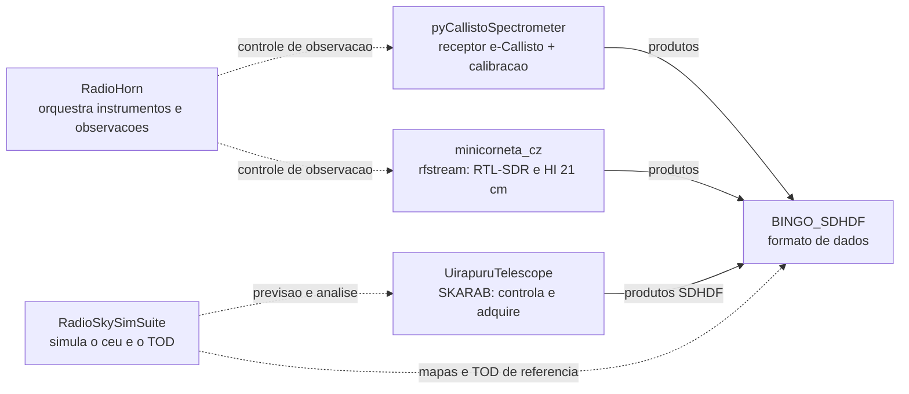

# Softwares da equipe BINGO-PB

Seis bases de código que cobrem a cadeia completa de um radiotelescópio de
single dish: **simulação** do céu de rádio, **aquisição** de banda larga,
**espectrômetros** de baixo custo, **operação do telescópio**, **formato de
dados** e a **instrumentação de calibração**.

Cada capítulo traz a descrição, as funcionalidades entregues, o que está
planejado, a *tech stack* e o grau de maturidade, com um diagrama Mermaid da
arquitetura.

| # | Projeto | Papel | Runtime | Estado declarado | Maturidade |
|---|---|---|---|---|---|
| 1 | [RadioSkySimSuite](01_radioskysimsuite.md) | Simulação/análise do céu (TOD + HEALPix) | Python 3.11–3.14 | `1 - Planning` (de fato muito além) | Alpha avançado, maior volume |
| 2 | [minicorneta_cz (rfstream)](02_minicorneta_cz.md) | Aquisição RF + HI 21 cm | Python ≥ 3.10 + C | `1.0.0` | Mais fechado; campo pendente |
| 3 | [BINGO_SDHDF](03_bingo_sdhdf.md) | Motor do formato SDHDF v4.0 | Python 3.11–3.13 | `0.1.0` – Pre-Alpha | Biblioteca sólida; rollout pendente |
| 4 | [pyCallistoSpectrometer](04_pycallistospectrometer.md) | Daemon e-Callisto + unidade de calibração | Python ≥ 3.10 + Arduino C++ | `1.0.0` – Production/Stable | Estável no escopo; firmware em RE |
| 5 | [UirapuruTelescope](05_uirapuru_telescope.md) | Operação do telescópio Uirapuru (SKARAB) | Python 2.7 + 3.11+ | `0.1.0` | Dois stacks, migração em curso |
| 6 | [RadioHorn](06_radiohorn.md) | Suíte de radioastronomia (orquestrador) | Python ≥ 3.8 | `0.1.0` – Alpha | Esqueletos + legado a migrar |

## Visão de conjunto



## Como usar

- Os arquivos são **MyST Markdown** (frontmatter `title`) e podem ser movidos
  para o site `BINGO-PB/Projetos` (`content/01_projetos/05_coding/`) ou para
  qualquer projeto MyST/mystmd — os blocos ```mermaid``` são renderizados
  nativamente.
- Os números de LOC, testes e datas vêm da inspeção do código e dos planos de
  cada repositório (setembro/2026), não de estimativas.
